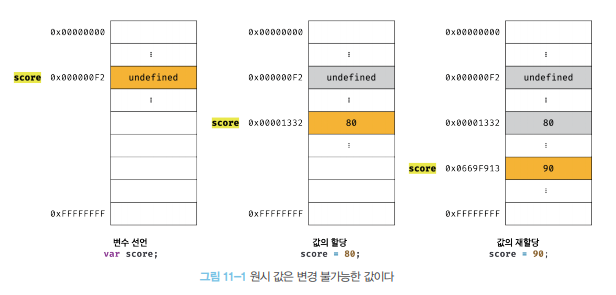
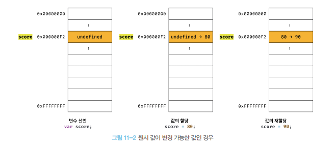
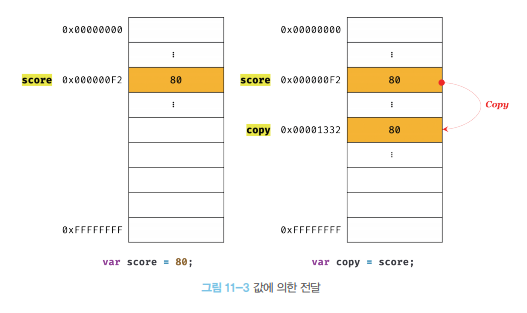
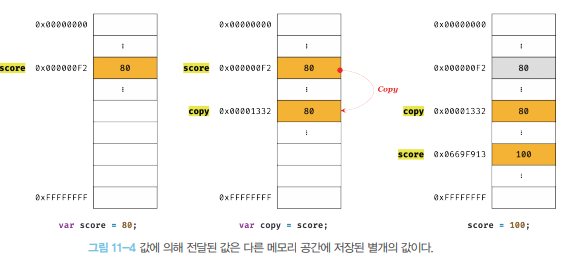
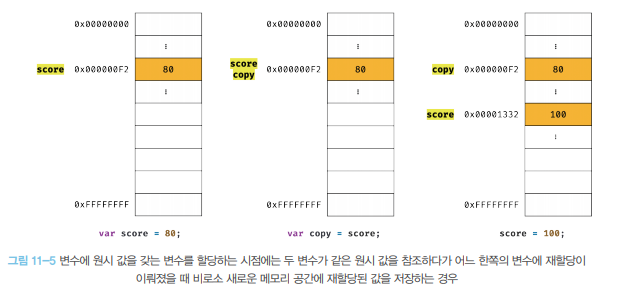
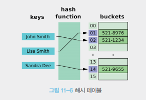
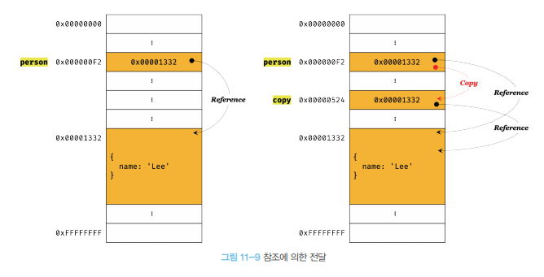

# 11 원시값과 객체의 비교

자바 스크립트가 제공하는 7가지 데이터 타입(숫자, 문자열, 불리언 null, undefined, 심벌, 객체 타입)은 크게 원시 타입과 객체 타입을 구분할 수 있다.
- 원시 타입의 값, 즉 원 값은 변경 불가능한 값이다. 이에 비해 객체 타입의 값, 즉 객체는 변경 가능한 값 이다.
- 원시 값을 변수에 할당하면 변수(확보된 메모리 공간) 에는 실제 값이 저장된다. 이에 비해 객체를 변수에 할당하면 변수(확보된 메모리 공간) 에는 참조 값이 저장 된다.
- 원시 값을 갖는 변수를 다른 변수에 할당하면 원본의 원시 값이 복사되어 전달된다. 이를 값에 의한 전달이라 한다. 이에 비해 객체를 가리키는 변수를 다른 변수에 할당하면 원본의 참조값이 복사되어 전달된다. 이를 참조에 의한 전달이라 한다.

## 11.1 원시값
원시타입의 값, 즉 원시 값은 변경 불가능한 값이다. 한번 생성된 원시 값은 읽기 전용 값으로서 변경할 수 없다. 값을 변경할 수 없다는 것이 구체적으로 무엇을 말하는지 생각해보자. 먼저 변수와 값은 구분해서 생각해야한다. 변수는 하나의 값을 저장하기 위해 확보한 메모리 공간 자체 또는 그메모리 공간을 식별하기 위해 붙인 이름이고, 값은 변수에 저장된 데이터로서 표현식이 평가도어 생성된 결과를 말한다. 변경 불가능하다는것은 변수가 아니라 값에 대한 진술이다.

즉 "원시 값은 변경 불가능하다"는 말은 원시 값 자체를 변경할 수 없다는 것이지 변수 값을 변경할 수 없다는 것이 아니다. 변수는 언제든지 재할당을 통해 변수 값을 변경할 수 있다. 그렇기 때문에 변수라고 부른다. 

변수의 상대 개념인 상수는 재할당이 금지된 변수를 말한다. 상수도 값을 저장하기 위한 메모리 공간이 필요하므로 변수라고 할 수 있다. 단, 변수는 언제든지 재할당을 통해 변수 값을 변경할 수 있지만 상수는 단 한 번만 할당이 허용되무로 변수 값을 변경할 수 없다. 따라서 상수와 변경 불가능한 값을 동일시하는것은 곤란하다. 상수는 재할당이 금지된 변수일 뿐이다.

~~~javascript
//const 키워드를 사용해 선언한 변수는 재할당이 금지된다. 상수는 재할당이 금지된 변수일 뿐이다.
const o = []

// const 키워드를 사용해 선언한 변수에 할당한 원시 값은 변경할 수 없다.
// 하지만 const 키워드를 사용해 선언한 변수에 할당한 객체는 변경할 수 있다
o.a = 1;
console.log(o); // {a : 1}
~~~

원시 값은 변경 불가능한 값, 즉 읽기 전용 값이다. 원시 값은 어떤 일이 있어도 불변한다. 이러한 원시 값의 특성은 데이터의 신뢰성을 보장한다.

4.5절 "값의 할당"에서 살펴보았듯이 원시 값을 할당한 변수에 새로운 원시 값을 재할당하면 메모리 공간에 저장되어 있는 재할당 이전의 원시 값을 변경하는 것이 아니라 새로운 메모리 공간을 확보하고 재할당한 원시 값을 저장한 후, 변수는 새롭게 재할당한 원시 값을 가리킨다. 이때 변수가 참조하던 메모리 공간의 주소가 바뀐다.

변수가 참조하던 메모리 공간의 주소가 변경된 이유는 변수에 할당된 원시 값이 변경 불가능한 값이기 때문이다. 만약 원시 값이 변경 가능한 값이라면 변수에 새로운 원시 값을 재할당했을 때변수가 가리키던 메모리 공간의 주소를 바꿀 필요없이 없시 값 자체를 변경하면 그만이다. 만약 그렇다면 변수가 ㅏㅁ조하던 메모리 공간의 주소는 바뀌 않는다.

하지만 원시 값은 변경 불가능한 값이기 때문에 값을 직접 변경할 수 없다. 따라서 변수 값을 변경하기 위해 원시 값을 재할당하면 새로운 메모리 공간을 확보하고 재할당한 값을 저장한 후 , 변수가 참조하던 메모리 공간의 주소를 변경한다. 값의 이러한 특성을 불변성이라한다.

불변성을 갖는 원시 값을 할당한 변수는 재할당 이외에 변수 값을 변경할 수 있는 방법이 없다. 만약 재할당 이외에 원시 값인 변수 값을 변경할 수 있다면 예기치 않게 변수 값이 변경될 수 있다는 것을 의미한다. 이는 값의 변경, 즉 상태 변경을 추적하기 어렵게 만든다.

## 11.1.2 문자열과 불변성
원시 값을 저장하려면 먼저 확보해야 하는 메모리 공간의 크기를 결정해야 한다. 이를 위해 원시 타입별로 메모리 공간의 크기가 미리 정해져 있다고 했다. 단 ECMAScipt 사양에 문자열 타입(2바이트)과 숫자 타입(8바이트) 이외위 원시 타입은 크기를 명확히 규정하고 있지는 않아서 브라우저 제조사의 구현에 따라 원시 타입의 크기는 다룰수 있다.

원시 값인 문자열은 다른 원시 값과 비교할 때 독특한 특징이 있다. 문자열은 0개 이상의 문자로 이뤄졌느냐에 따라 필요한 메모리 공간의 크기가 결정된다.

~~~javascript
// 문자열은 0개 이상의 문자로 이뤄진 집합이다.
var str1 = '';      // 0갸의 문자로 이뤄진 문자열(빈 문자열)
var str2 = 'Hello'; // 5개의 문자로 이뤄진 문자열
~~~
자바스크립트의 문자열은 원시 타입이며, 변경 불가능하다. 이것은 문자열이 생성된 이후에는 변경할 수 없음을 의미한다.

~~~javascript

var str1 = 'Hello';
str1 = 'world';
~~~

첫 번째 문이 실행되면 문자열 'Hello'가 생성되고 식별자 str은 문자열 'Hello' 가 저장된 메모리 공간의 첫번쨰 메모리 셀 주소를 가리킨다. 그리고 두 번째 문이 실행되면 이전에 생성된 문자열 'Hello'를 수정하는 것이 아니라 새로운 문자열 'world'를 메모리에 생성하고 식별자 str은 이것을 가리킨다. 이때 문자열 'Hello'와 'world' 는 모두 메모리에 존재한다. 식별자 str은 문자열 'Hello'를 가리키고 있다가 문자열 'world'를 가리키도록 변경되었을 뿐이다.

문자열의 한 문자를 변경해 보자. 문자열은 유사 배열 객체이면서 이터러블 이므로 배열과 유사하게 각 문자에 접근할 수 있다.

### 유사 배열 객체
유사 배열 객체란 배열 처럼 이넥스로 프로퍼티 값에 접근할 수 있고 length 프로퍼티를 갖는 객체를 말한다. 문자열은 마치 배열 처럼 인덱스를 통해 각 문자에 접근할 수 있으며 length 프로퍼티를 갖기 때문에 유사 배열 객체이고 for 문으로 순회할 수 도 있다.
~~~javascript
var str = 'string';

// 문자열은 유사 배열이므로 배열과 유사하게 인덱스를 사용해 각 문자에 접근할 수 있다.
console.log(str[0]); // s

// 원시 값인 문자열이 객체처럼 동작한다.
console.log(str.length); // 6
console.log(str.toUpperCase()); // STRING
~~~
원시 값인 문자열이 객체일 수도 있다니 혼란스러울 수 있겠다. 아직 살펴보지 않았지만 원시 값을 객체처럼 사용하면 원시값을 감싸는 래퍼 객체로 자동 변환된다

~~~javascript
var str = 'string'

//  문자열은 유사 배열이므로 배열과 유사하게 인덱스를 사용해 각 문자에 접근할 수 있다.
//  하지만 문자열은 원시 값이므로 변경할 수 없다. 이때 에러가 발생하지 않는다.
str[0] = 'S';

console.log(str); // string
~~~

str[0] = 'S' 처럼 이미 생성된 문자열의 일부 문자를 변경해도 반영되지 않는다. 문자열은 변경 불가능한 값이기 때문이다. 이처럼 한번 생성된 문자열은 읽기 전용 값으로서 변경할 수 없다. 원시 값은 어떤 일이 있어도 불변한다 따라서 예기치 못한 변경으로부터 자유롭다. 이는 데이터의 신뢰성을 보장한다.

그러나 변수에 새로운 문자열을 재할당하는 것은 물론 가능하다. 이는 기존 문자열을 변경하는 것이 아니라 새로운 문자열을 새롭게 할당하는 것이기 때문이다.

## 11.1.3 값에 의한 전달

~~~javascript
var score = 80;
var copy = score;

console.log(score);     //80
console.log(copy);     //80

score = 100;

console.log(score); //100
console.log(copy); //?
~~~
score 변수에 숫자 값 80을 할당했다. 그리고 copy 변수에 score 변수를 할당했다. score 변수에 새로운 숫자값 100을 재할당하면 copy 변수으 값은 어떻게 될까?

"변수에 변수를 할당했을 때 무엇이 어떻게 전달도는가?" copy = score에서 scre는 변수 값 80으로 평가되므로 copy 변수에도 80이 할당될 것이다. 이때 새로운 숫자 값 80아 생성되어 copy변수에 할당된다.
이처럼 변수에 원시 값을 갖는 변수를 할당하면 할당받는 변수 (copy)에는 할당되는 변수 (score)의 원시 값이 복사도어 전달된다. 이를 값에 의한 전달이라 한다. 위 예제의 경우 copy 변수에 원시 값을 갖는 score변수를 할당하면 할당받는 변수(copy)에는 할당되는 변수(score)의 원시 값 80이 복사되어 전달된다.

~~~javascript
var score = 80;
// copy 변수에는 score 변수의 값 80이 복사되어 할당된다.
var copy = score;

console.log(score, copy); // 80 80
console.log(score == copy); // true

~~~

이때 score 변수와 copy변수는 숫자값 80을 갖는다는 점에서는 동일하다. 하지만 score 변수와 copy 변수의 값 80은 다른 메모리 공간에 저장된 별개의 값이다.

~~~javascript
var score = 80;

// copy 변수에는 score 변수의 값 80이 복사되어 할당돈다.
var copy = score;
console.log(score, copy);
console.log(score, === copy); // true

// score 변수와 copy 변수의 값은 다른 메모리 공간에 저장된 별개의 값이다.
// 따라서 score 변수의 값을 변경해도 copy 변수의 값에는 어떠한 영향도 주지 않는다

console.log(score, copy);   100 80
console.log(score === copy);   //false
~~~
score 변수와 copy 변수의 값 80은 다른 메모리 공간에 저장된 별개의 값이라는 것에 주의하기 바란다. 따라서 score 변수의 값을 변경해도 copy 변수의 값에는 어떠한 영향도 주지 않는다

위 그림은 실제 자바스크립트 엔진의 내부 동작과 정확히 일치하지 않을 수 있다. ECMAScript 사양에는 변수를 통해 메모리를 어떻게 관리해야 하는지 명확하게 정의되어 있지 않다. 따라서 실제 자바스크립트 엔진을 구현하는 제조사에 따라 실제 내부 동작은 미묘한 차이가 있을 수 있다.
위 그림에서는 변수에 원시 값을 갖는 변수를 할당하면 원시 값이 복사되는 것으로 표현했다. 하지만 변수에 원시 값을 갖는 변수를 할항하는 시점에는 두 변수가 같은 원시 값을 참조하다가 어느 한쪽의 변수에 재할당이 이워졌을 때 비로소 새로운 메모리 공간에 재할당된 값을 저장하도록 동작할 수도 있다.

## 객체 
객체는 프로퍼티의 개수가 정해져 있지 않으며, 동적으로 추가되고 삭제할 수 있다. 또한 프로퍼티의 값에도 제약이 없다. 따라서 객체는 원시 값과 같이 확보해야 할 메모리 공가의 크기를 사전에 정해 둘 수 없다. 객체는 복합적인 자료구조이므로 객체를 관리하는 방식이 원시 값과 비교해서 복잡하고 구현 방식도 브라우저 제조사마다 다를 수 있다. 객체를 생성하고 프로퍼티에 접근하는 것도 원시 값과 비교할 때 비용이 많이 드는 일이다.
따라서 객체는 원식 값과는 다른 방식으로 동작하도록 설계되어 있다. 원시값과의 비교를 통해 객체를 이해해 보자

### 자바스크립트 객체의 관리 방식 
자바스크립트 객체는 프로퍼티 키를 인덱스로 사용하는 해시 테이블 (해시 테이블은 연관 배열이라 부르기도 한다)이라고 생각할 수 있다. 대부분의 자바스크립트 엔진은 해시 테이블과 유사하지만 높은 성능을 위해 일반적인 해시 테이블보다 나은 방법으로 객체를 구현한다.

## 변경 가능한 값
객체(참조) 타입의 값, 즉 객체는 변경 가능한 값이다. 먼저 변수에 객체를 할당하면 어떤 일이 일어나는지부터 살펴보자
~~~javascript
var person = {
    name: 'Lee'
};
~~~
원시값을 할당한 변수가 기억하는 메모리 주소를 통해 메모리 공간에 접그나면 원시 값에 접근할 수 있다. 즉 원시값을 할당한 변수는 원시값 자체를 값으로 갖는다. 하지만 객체를 할당한 변수가 기억하는 메모리 주소를 통해 메모리 공간에 접근하면 참조 값에 접근할 수 있다. 참조 값은 생성된 객체가 저장된 메모리 공간의 주소, 그자체다

다음 그림을 보면 객체를 할당한 변수에는 생성된 객체가 실제로 저장된 메모리 공간의 주소가 저장되어 있다 이값을 참조 값이라고 한다. 변수는 이 참조 값을 통해 객체에 접근할 수 있다.

원시 값을 할당한 변수를 참조하면 메모리에 저장되어 있는 원시 값에 접근한다. 하지만 객체를 할당한 변수를 참조하면 메모리에 저장되어 있는 참조 값을 통해 실제 객체에 접근다.

~~~javascript
// 할당이 이뤄지는 시점에 객체 리터럴이 해석되고, 그결과 객체가 생성된다.
var person = {
    name: 'Lee'
};

//person 변수에 저장되 있는 참조 값으로 실제 객체에 접근한다.
console.log(person); // {name: 'Lee'}
~~~

일반적으로 원시 값을 할당한 변수의 경우 "변수는 O값을 갖는다" 또는 "변수의 값은 O다"라고 표현한다. 하지만 객체를 할당한 변수의 경우 "변수는 객체를 참조하고 있다" 또는 "변수는 객체를 가리키고 있다"라고 표현한다. 위 예제에서 person 변수는 객체 {name: 'Lee'}를 가리키고 (참조하고) 있다.
원시 값은 변경 불가능한 값이므로 원시 값을 갖는 변수의 값을 변경하려면 재할당 외에는 방법이 없다. 하지만 객체는 변경가능한 값이다. 따라서 객체를 할당한 변수는 재할당 없이 객체를 직접 변경할 수 있다. 즉, 재할당 없이 프로퍼티를 동적으로 축할 수도 있고 프로퍼티값을 갱신할 수도 있으며 프로퍼티 자체를 삭제할 수도 있다.
~~~javascript
var person = {
    name: 'Lee'
}
// 프로퍼티 값 갱신
person.name = 'Kim';

// 프로퍼티 동적 생성
person.address = 'Seoul';

console.log(person); // {name: 'kim', address: "Seoul"}
~~~
원시 값은 변경 불가능한 값이므로 원시값을 갖는 변수의 값을 변경하려면 재할당을 통해 메모리에 원시 값을 새롭게 생성해야한다. 하지만 객체는 변경 가능한 값이므로 메모리에 저장된 객체를 직접 수정할 수 있다. 이때 객체를 할당한 변수에 재할당을 하지 않았으므로 객체를 할당한 변수의 참조 값은 변경되지 않는다.

객체를 변경할 때마다 원시 값처럼 이전 값을 복사해서 새롭게 생성한다면 명확하고 신뢰성이 확보되겠지만 객체는 크기가 매우 클수도 있고, 원시값처럼 크기가 일정하지도 않으며, 프로퍼티 값이 객체일 수도 있어서 복사해서 생성하는 비용이 많이 든다. (메모리의 효율적 소비가 어렵고 성능이 나빠진다.)

- 여러 개의 식별자가 하나의 객체를 공유할 수 있다.

### 얕은 복사 깊은 복사
객체를 프로퍼티 값으로 갖는 객체의 경우 얕은 복사는 한단계까지만 복사하는 것을 말하고 깊은 복사는 객체에 중첩되어 있는 객체까지 모두 복사하는 것을 말한다.

~~~javascript
const o = {x: {y:1}};

// 얕은 복사
const c1 = { ...o};     //35장 "스프레드 문법" 참고
console.log(c1 === o);  // false
console.log(c1.x === o.x); //true

// lodash의 clonDeep을 사용한 깊은 복사
// "npm install lodash"로 lodash를 설치한 후, Node.js 환경에서 실행
const_ = require('lodash');
// 깊은 복사
const c2 = _.cloneDeep(o);  
consle.log(c2 === o);   //false
consle.log(c2.x === o.x);   //false
얕은 복사와 깊은 복사로 생성된 객체는 원복과는 다른 객체다 즉 원복과 복사본은 참조 값이 다른 별개의 객체다. 하지만 얕은 복사는 객체에 중첩되어 있는 객체의 경우 참조 값을 복사하고 깊은 복사는 객체에 중첩되어 있는 객체까지 모두 복사해서 원시 값처럼 완전한 복사본을 만든다는 차이가 있다.
참고로 다음과 같이 원시 값을 할당한 변수를 다른 변수에 할당하는 것을 깊은 복사 객체를 할당한 변수를 다른 변수에 할당하는 것을 얕은 복사라고 부르는 경우도 있다
~~~javascript
const v = 1;

// "깊은 복사" 라고 부르기도 하낟.
const c1 =v;
console.log(c1 === v); //true

const o = {x: 1};

// "얕은 복사" 라고 부르기도 한다.
const c2 = o;
console.log(c2 === o); //true
~~~

## 11.2.2 참조에 의한 전달 
여러 개의 식별자가 하나의 객체를 공유할 수 있다는 것이 무엇을 의미하는지, 이로 인해 어떤 부작용이 발생하는지 확인해 보자.

~~~javascript
var person = {
    name: 'Lee'
};
// 참조 값을 복사 (얕은 복사)
var copy = person;
~~~

객체를 가리키는 변수 (원복, person)를 다른 변수 (사본, copy)에 할당하면 원본의 참조 값이 복사되어 전달된다. 이를 참조에 의한 전달이라 하낟.

위 그림처럼 원본 person을 사본 copy에 할당하면 원본 person의 참조 값을 복사해서 copy에 저장한다. 이때 원본 person과 사본 copy는 저장된 메모리 주소는 다르지만 동일한 참조 값을 갖는다. (원본 person 과 사본 copy는 모두 동일한 객체를 가리킨다.) 두개의 식별자가 하나의 객체를 공유하나다는 것을 의미한다. 따라서 원본 또는 사본중 어느 한쪽에서 객체를 변경(변수에 새로운 객체를 재할당하는 것이 아니라 객체의 프로퍼티 값을 변경하거나 프로퍼티를 추가, 삭제)하면 서로 영향을 주고받는다.

~~~javascript
var person = {
    name: 'Lee'
};

// 참조 값을 복사(얕은 복사).  copy와 person은 동일한 참조 값을 갖는다.
var copy = person;

// copy와 person은 동일한 객체를 참조한다.
console.log(copy === person); //true

// copy를 통해 객체를 변경한다.
copy.name = 'kim';

// person을 통해 객체를 변경한다.
person.address = 'Seoul';

// copy와 person은 동일한 객체를 가리킨다.
// 따라서 어느 한쪽에서 객체를 변경하면 서로 영향을 주고받는다.
console.log(person); // {name: "Kim", address: "Seoul"}
console.log(copy); // {name: "Kim", address: "Seoul"}
~~~
결국 "값에 의한 전달"과 "참조에 의한 전달"은 식별자가 기억하는 메모리 공간에 저장되어 있는 값을 복사해서 전달한다는 면에서 동일하다. 다만 식별자가 기억하는 메모리 공간, 즉 변수에 저장되어 있는 값이 원시 값이냐 참조 값이냐의 차이만 있을 뿐이다. 따라서 자바스크립트에는 "참조에 의한 전달"은 존재하지 않고 "값에 의한 전달"만이 존재한다고 말할 수 있다. 앞에서 언급했듯이 자바스크립트의 이 같은 동작 방식을 설명하는 정확한 용어가  존재하지 않는다. 이런 이유로 "값에 의한 전달" 이나 "참조에 의한 전달"이라는 용어를 사용하지 않고 "공유에 의한 전달" 이라고 표현하는 경우도 있다. 하지만 이용어 또한 ECMAScript 사용에 정의된 자바스크립트의 공식적인 용어는 아니며 자바스크립의 동작 방식을 정확히 설명하지 못한다.

전달되는 값의 종류가 원시 값인지 참조 값인지 구별해서 강조하는 의미에서 "값에 의한 전달" 과 "참조에 의한 전달"로 구분하여 부르기도 한다. 다만 자바스크립트에는 포인터가 존재하지 않기 때문에 포인터가 존재하는 다른 프로그래밍 언어의 "참조에 의한 전달"과 의미가 정확히 일치하지 않는다는 점에 주의하기 바란다.

~~~javascript
    var person1 = {
        name: 'Lee'
    };

    var person2 = {
        name: 'Lee'
    }; 

    console.log(person1 === person2);           // ?
    console.log(person1.name == person2.name);  // ?
~~~
=== 일치 비교 연산자는 변수에 저장되어 있는 값을 타입 변환하지 않고 비교한다.

객체를 할당한 변수는 참조 값을 가지고 있고, 원시 값을 할당한 변수는 원시 값 자체를 비교하면 원시 값을 비교한다
객체 리터럴은 평가될 때마다 객체를 생성한다. 따라서 person1 변수와 person2변수가 가리키는 객체는 비록 내용은 같지만 다른 메모리에 저장된 별개의 객체다. 즉, person1 변수와
person2 변수의 참조 값은 전혀 다른 값이다.
