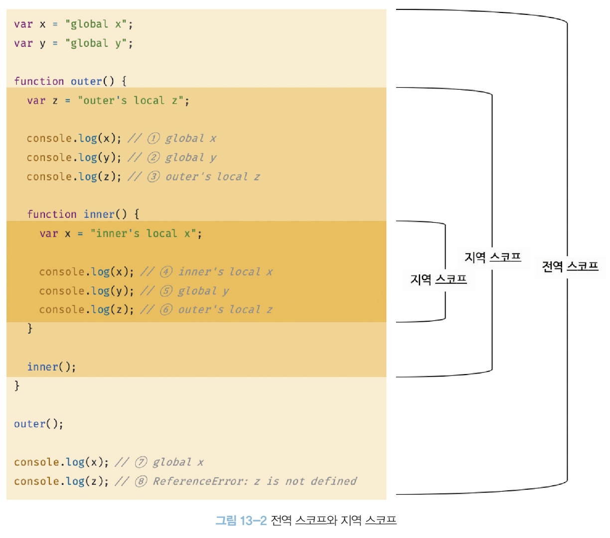
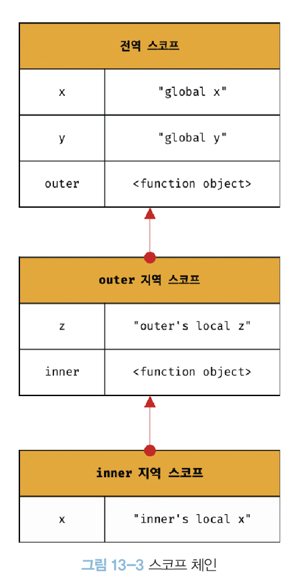

### 13. 스코프


#### 13.1 스코프란? 

##### 13.1.1 스코프 

* 자바스크립트에서 `스코프`는 다른언어의 스코프 개념과 다른점이 존재
* 변수 및 함수와 관련 ! (변수와 함수의 유효범위에 관해서)

앞선 스코프 예제

Ex) 함수 매개변수는 함수 몸체 내부에서만 참조가능하고 외부에서 참조 불가

=> 매개변수의 `스코프(유효범위)`는 함수 몸체 내부..!

```javascript
function add(x, y){
  // 매개변수는 함수 몸체 내부에서만 참조 가능 !
  console.log(x, y) // 2 5
  return x + y;
}
add(2, 5);

console.log(x,y); // ReferenceError !!!
```


##### 13.1.2 변수의 유효 범위

> 변수는 자신이 선언된 위치에 의해 자신의 `스코프(유효범위)` 가 결정된다. ( 다른코드가 변수를 참조할수 있는가를 결정 )
>
> 변수뿐 아니라 `모든 식별자(변수이름, 함수이름, 클래스이름 등)`는 자신이 선언된 위치에 따라 `스코프 ` 결정
>
> 따라서 스코프는 **`식별자가 유효한 범위 !`**

Ex)1

```javascript
var var1 = 1; //전역변수

if(true) {
	var var2 = 2; // 코드블록안에 변수
	if(true){
		var var3 = 3; // 중첩된 코드 블록안에서 변수
	}
}

function foo(){
  var var4 = 4;
  
  function bar(){
    var var5 = 5;
  }
}
// 코드블록 및 전역은 참조 가능 , 함수안에 선언된 변수는 참조 불가능
console.log(var1);	//1
console.log(var2);	//2
console.log(var3);	//3
console.log(var4);	// ReferenceError
console.log(var5);	// ReferenceError

```

Ex)2 어떻게 동작??

```javascript
var x = 'global';

function foo(){
  var x = 'local';
  console.log(x)		// 1번
}

foo();

console.log(x);			// 2번
```

> **자바스크립트 엔진은 이름이 같은 두 개의 변수 중에서 어떤 변수를 참조해야 할 것인지를 결정하는 것을 `식별자 결정` 이라고 한다.**

전역에 `변수 x` 선언되어 있고 foo 함수 내부에 동일한 이름 `변수 x` 가 선언되어있다. 자바스크립트 엔진은 `스코프` 를 통해 어떤 변수를 참조해야 할 것인지를 결정. 따라서 `스코프` 는 **자바스크립트 엔진이 식별자를 검색할 때 사용하는 규칙**

스크립트 엔진은 코드 실행할때 코드의 문맥을 고려해 코드가 어디서 실행되며 주변에 어떤 코드가 있는지 따라 동일 코드 다른 결과를 만들어낸다.

=> *참고* : *코드가 어디서 실행되며 주변에 어떤 코드가 있는지를 `렉시컬 환경`이라고 부르고 코드의 문맥은 렉시컬 환경으로 이루어 지며, 이를 구현한 것이 `실행 컨텍스트`이다. 모든 코드는 실행 컨텍스트에 평가되고 실행됨.*

=> 해설 : 위 예제에서 코드의 가장 바깥 영역에 선언된 `변수 x`는 어디서도 참조 가능하고 foo 함수 내부에서 선언된 `변수 x`는 foo 함수 내부에서만 호출가능하고, 외부에서 참조 불가

**두개의 변수는 식별자 이름이 동일 하지만 자신의 유효범위(스코프) 가 다른 별개의 변수 **

> 따라서 1번 값은 `local`  2번 값은 `global`


`식별자` 는 어떤 값을 구별하여 식별해 낼수 있는 고유의 이름이며, 유일해야하고, 하나의 값은 유일한 식별자에 연결되어야 한다.

=> 자바스크립트(전체 프로그래밍 언어)는 스코프를 통해 식별자인 변수 이름의 충돌을 방지하여 같은 이름의 변수를 사용할 수 있게 하며, **스코프 내에서 식별자는 유일해야 하지만 다른 스코프에서는 같은 이름의 식별자를 사용할 수 있다.**


##### 13.1.3 (참고) var 키워드로 선언한 변수의 중복 선언

> var 키워드로 선언된 변수는 같은 스코프 내에서 중복선언이 허용된다. 이는 의도치 않게 변수값이 재할당 되어 변경되는 부작용을 발생 ! => **`let 이나 const 키워드 사용을 권고 !`**
>
> ```javascript
> function bar(){
>   // var 키워드로 선언되 변수는 같은 스코프 내에서 중복 선언을 허용
>   // 아래 변수 선언문은 자바스크립트 엔진에 의해 var 키워드가 없는 것 처럼 동작
> 	var x = 1;
>   var x = 2;	// 엔진 평가  (var)x = 2
>   console.log(x); //2
> }
> foo();
> 
> function bar(){
>   //let , const 키워드로 선언된 변수는 같은 스코프 내에서 중복 선언을 허용 x !
>   let x = 1;
>   let x = 2;	// SyntaxError: Identifier 'x' has already been declared
> }
> bar();
> ```


#### 13.2 스코프의 종류

> 코드는 전역(global)과 지역(local)으로 구분
>
> 전역 : 코드의 가장 바깥영역으로 전역 스코프를 가지며 이러한 변수를 전역변수라고한다.
>
> 지역 : 함수 몸체 내부의 영역으로 지역 스코프를 가지며 이러한 변수를 지역변수라고 한다.


##### 13.2.1 전역과 전역 스코프 

> 쉽게 생각해서 현재 선언된 곳보다 뎁스가 깊은 곳에서는 참조 가능, 반대로는 불가능



> 전역 코드는 가장 바깥 영역으로 `전역스코프`를 만든다. 전역에 선언된 변수는 전역 스코프를 가지는 전역 변수가 되며 **어디서든지 참조 할 수 있다.** 위 예제 에서는 `var x , var y` 가 전역변수


##### 13.2.2 지역과 지역 스코프

> 지역코드는 함수 몸체 내부영역으로 `지역스코프`를 만든다. 지역에 변수를 선언하면 지역 스코프를 가지는 지역 변수가 되며 **자신이 선언된 지역과 하위 지역(중첩 함수)에서만 참조 할 수 있다. ** 
>
> `function outer()` 내부의 변수 `var z` 는 지역 변수이며 `outer() , 하위 중첩함수 inner()` 내에서 유효

**inner() 함수 내부의 변수 x 는 어떻게 평가될까?**

=> 전역을 참조하는 것이 아닌 지역변수 `var x = "innder's local x"` 를 참조 !

WHY ? = > **스코프 체인을 통해 참조할 변수를 검색 했기 때문에**


#### 13.3 스코프 체인

> 함수 몸체 내부에서 정의한 함수를 **중첩 함수**, 중첩 함수를 포함하는 함수를 **외부 함수**라고 하며,
>
> 함수는 중첩될 수 있으므로 함수의 지역스코프도 중첩 될 수 있다.
>
> => **스코프가 함수의 중첩에 의해 `계층적 구조`를 갖는다**
>
> => 중첩 함수의 지역 스코프는 중첩 함수를 포함하는 외부 함수의 지역 스코프와 계층적 구조를 갖고, 이때 외부 함수의 지역 스코프를  중첩 함수의 상위 스코프라고 한다.

Ex) 위 예제 `inner() 와 outer()`  의 관계

Outer() : 외부 함수, inner()의 상위 스코프

inner() : 중첩 함수, 계층적 구조, 상위스코프 Outer() 참조 가능.



>모든 스코프는 하나의 계층적 구조로 연결되며, **모든 지역 스코프의 최상위 스코프는 `전역 스코프` 이다**
>
>이렇게 스코프가 계층적으로 연결된 것을 `스코프 체인` 이라고함.

**변수를 참조할 때 자바스크립트 엔진은 스코프 체인을 통해 변수를 참조하는 코드의 스코프에서 시작하여 상위 스코프 방향으로 이동하며 선언된 변수를 검색 한다. 이를 통해 상위 스코프에서 선언한 변수를 하위 스코프에서도 참조 가능 ! **

=>     `하위 => 상위 방향` 참조 !!!!!!!!!

실제  자바스크립트 엔진은 코드를 실행하기 전 위 예제와 유사한 자료구조인 `렉시컬 환경` 을 실제로 생성하고, 변수 선언이 실행되면 변수 식별자가 이 자료구조(렉시컬 환경)에 `키` 로 등록되고, 변수 할당이 일어나면 이 자료구조의 변수 식별자에 해당하는 값을 변경한다. 변수의 검색도 이 자료구조 상에서 이루어짐.

`렉시컬 환경 ??`

>  스코프 체인은 실행 컨텍스트의 렉시컬 환경을 단방향으로 연결 한 것으로, 전역 렉시컬 환경은 코드가 로드되면 곧바로 생성되고 함수의 렉시컬 환경은 함수가 호출되면 곧바로 생성됨.


##### 13.3.1 스코프 체인에 의한 변수 검색 

> 4, 5, 6 을 통한 자바스크립트 엔진이 스코프 체인을 통해 어떻게 변수를 찾아내는지 이해

- `4. x 변수`  를 참조하는 코드의 스코프인 `inner()함수`의 지역 스코프에서 `x 변수`가 선언되었는지 검색, 검색 결과 `x 변수`존재하여 해당 변수 참조 후 검색 종료

- `5. y 변수` 를 참조하는 코드의 스코프인 `inner()함수`의 지역 스코프에서 `y 변수`가 선언되었는지 검색, 검색 결과  없음, 존재하지 않아 상위 스코프 `outer() 함수`의 지역 스코프에서 검색, 검색 결과 없음,  상위 스코프 전역 스코프에서 `y 변수` 검색 결과 찾아 참조 후 검색 종료
- `6. z 변수`를 참조하는 코드의 스코프인 `inner()함수`의 지역 스코프에서 `z 변수`가 선언되었는지 검색, 검색 결과 없음, 존재하지 않아 상위 스코프 `outer() 함수`의 지역 스코프에서 검색 결과 `y 변수` 찾고, 참조 후 검색 종료

=> **자바스크립트 엔진은 스코프 체인을 따라 변수를 참조하는 코드의 스코프에서 시작해서 상위 스코프 방향으로 이동하며 선언된 변수를 검색 ! 반대는 x**

=> **상위 스코프에서 유효한 변수는 하위 스코프에서 자유롭게 참조할 수 있지만 하위 스코프에서 유효한 변수를 상위 스코프에서 참조할 수 없다.** (스코프 체인으로 연결된 스코프의 계층적 구조는 부자 관계로 이뤄진 `상속`과 유사)

```javascript
var x = "global x";
var y = "global y";

function outer(){
  var z = "outer's local z";
  
  console.log(x);			//1. global x
  console.log(y);			//2. global y
  console.log(z);			//3. outer's local z
  
  function inner(){
    var x = "inner's local x";
    
    console.log(x);			//4. inner's local x
    console.log(y);			//5. global y
    console.log(z);			//6. outer's local z
  }
  inner();
}
outer();

console.log(x);			//7. global x
console.log(z);			//8. ReferenceError: z is not defined
```


##### 13.3.2 스코프 체인에 의한 함수 검색

> `함수 선언문` 및 `함수 생성 시점과 함수 호이스팅` 에서 살펴보았을때 함수 선언문으로 함수를 정의하면 런타임 이전에 함수 객체가 먼저 생성되고, 자바스크립트 엔진은 함수 이름과 동일한 이름의 식별자를 암묵적으로 선언하고 생성된 함수 객체를 할당.

- 위 예제의 모든 함수는 함수이름과 동일한 이름의 식별자에 할당.
- `1` 에서 `foo()` 호출하면 자바스크립트 엔진은 함수 호출을 위해 먼저 함수를 가리키는 `식별자 foo` 검색
- 함수도 식별자에 할당되기 때문에 스코프를 가짐.
- 함수는 식별자에 함수 객체가 할당된 것 외에 변수와 차이점 x
- `식별자를 검색하는 규칙` 으로 봐도 무방 (함수나 변수나 똑같이 적용된다 스코프 체인 검색에..)

```javascript
// 전역 함수
function foo(){
  console.log('global function foo');
}

function bar(){
  function foo(){
    console.log('local function foo');
  }
  foo();		// 1.
}
bar();			// 2.
```


#### 13.4 함수 레벨 스코프

> C 나 JAVA 등 대부분 프로그래밍 언어는 함수 몸체만이 아닌 모든 코드 블록( if, for, while, try/catch 등) 이 지역 스코프를 만든다. 이러한 특성을 **`블록 레벨 스코프`** 라고 부름. 
>
> ***BUT*** `var 키워드` 로 선언된 변수는 오로지 함수의 코드 블록(함수 몸체)만을 지역 스코프로 인정. 이러한 특성을 **`함수 레벨 스코프`**라고 한다.

가급적 `var 키워드` 를 사용하면 안되는 이유

```javascript
var x = 1;

if(true){
  // var 키워드로 선언된 변수는 함수의 코드 블록만을 지역 스코프로 인정
  // 함수 밖에서 var 키워드로 선언된 변수는 코드 블록 내에서 선언되었다 해도 모두 전역변수
  // 따라서  x 는 전역변수, 기존 전역변수 x 가 있으므로, x변수는 중복선언되어 값이 재할당됨
  // 이러한 현상은 의도치 않게 변수 값이 변경되는 부작용을 발생시킨다.
  var x =10;
}
console.log(x); 	// 10
```


```javascript
var i = 10;

// for 문에서 선언한 i는 전역 변수다. 이미 선언된 전역 변수 i가 있으므로 중복 선언된다.
for(var i = 0; i < 5; i ++){
  console.log(i) 	// 0 1 2 3 4
}

// 의도치 않게 변수의 값이 변경됨.
console.log(i); 	// 5
```

> 블록 레벨 스코프를 지원하는 프로그래밍 언어에서는 for 문에서 반복을 위해 선언된 i 변수가 for문의 코드 블록 내에서만 유효한 지역 변수. **BUT** `var 키워드`로 선언된 변수는 블록 레벨 스코프를 인정하지 않기 때문에 i 변수는 전역 변수가 되어 변수 i 는 중복 선언되고 그결과 의도치 않은 전역 변수의 값이 재할당 된다.

=> **SO**  ES6 에서 도입된 `let, const 키워드` 는 블록 레벨 스코프를 지원한다. (무조건 이거 쓰자)


#### 13.5 렉시컬 스코프

```javascript
var x = 1;

function foo(){
  var x = 10;
  bar();
}

function bar(){
  console.log(x);
}

foo();	// 10? x	1 O
bar();	// 1?  x 	1 O
// 어디서 호출했는지는 상관 x , 무조건 정의한 곳 기준 !!
```

> 결정 과정 ? 
>
> 1. **함수를 어디서 호출 했는지**에 따라 함수의 상위 스코프를 결정한다.
> 2. **함수를 어디서 정의**했는지에 따라 함수의 상위 스코프를 결정한다.
>
> => 1번 결정 과정으로 상위 스코프 결정 시 bar 함수의 상위 스코프는 `foo 함수`의 지역 스코프와 전역 스코프 일 것이다.
>
> => 2번 결정 과정으로 상위 스코프 결정 시 bar 함수의 상위 스코프는 `전역 스코프`일 것이다.


대부분 이 두가지 결정 과정을 통해 함수의 상위 스코프를 결정

1. 첫번째 방식 => `동적 스코프` : 함수를 정의하는 시점에서는 함수가 어디서 호출될지 알 수 없다. 따라서 함수가 호출되는 시점에 동적으로 상위 스코프르르 결정하기 때문에 동적 스코프
2. 두번째 방식 => `렉시컬 스코프` OR `정적 스코프` : 동적 스코프 처럼 상위 스코프가 동적으로 변하지 않고 함수 정의가 평가되는 시점에 상위 스코프가 정적으로 결정되기 떄문에 정적 스코프라고 부른다. 

=> 자바스크립트는 `렉시컬 스코프` 를 따르므로 함수를 어디서 호출했는지가 아니라 **함수를 어디서 정의했는지에 따라 상위 스코프를 결정.** 함수가 호출된 위치는 상위 스코프 결정에 어떠한 영향도 주지 않음. 즉 **함수의 상위 스코프는 언제나 자신이 정의된 스코프이다.**

=> 함수의 상위 스코프는 함수 정의가 실행될 때 정적으로 결정되며, 함수 정의가 실행되어 생성된 함수 객체는 이렇게 결정된 상위 스코프르르 기억. 함수가 호출될 때마다 함수의 상위 스코프를 참조할 필요가 있기 때문에.

예제 결과 : `bar 함수`는 전역에서 정의된 함수로, 전역 코드가 실행되기 전에 먼저 평가되어 함수 객체를 생성. 이때 생성된 `bar 함수 객체`는 자신이 정의된 스코프, 즉 **전역 스코프를 기억**.  `bar 함수` 가 호출되면 호출된 곳이 어디인지 관계없이 언제나 자신이 기억하고 있는 전역 스코프를 상위 스코프로 사용.