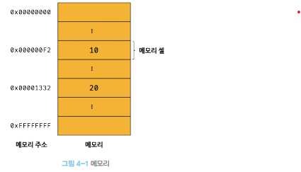
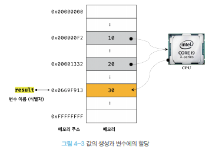
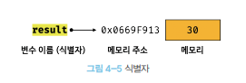
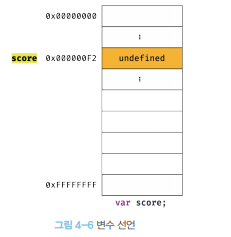
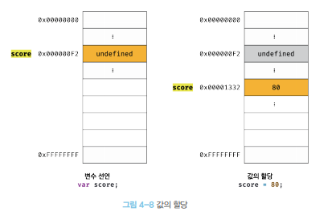
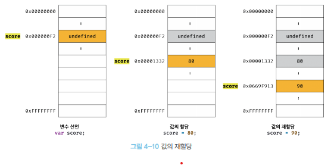
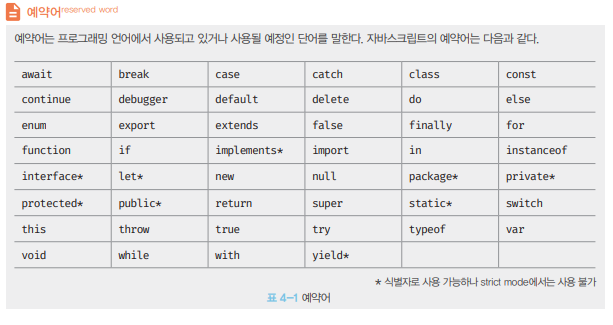

#### Chapter4 변수

>*변수란 ?*
>
>하나의 값을 저장하기 위해 확보한 메모리 공간 자체 또는 그 메모리 공간을 식별하기 위해 붙인 이름
>
>=> 값의 위치를 가리키는 상직적 이름


##### 4.1 변수란 무엇인가 ? 왜 필요한가?

> 아무리 복잡한 애플리케이션이라 해도 데이터를 **입력(input)** 받아 처리하고 그 결과를 **출력(output)** 하는 것이 전부이다. 변수는 프로그래밍 언어에서 데이터 전처리를 위한 핵심 개념


4.1.1 사람 vs 컴퓨터(예제)   Ex)`10 + 20`

전제 조건

1. 사람

   > 1.1 사람이 이 식을 해석하기 위해서 10, 20, + 의 의미를 알아야함
   >
   > 1.2 10+20 식의 의미 해석 가능해야함
   >
   > 1.3 두뇌에 10, 20 , 10+20 결과를 기억

2. 컴퓨터(자바 스크립트 기준)

   > 2.1 자바 스크립트 엔진은 10,20,+ 기호 `리터럴(literal) 과 연산자(operator)` 의미를 알아야함
   >
   > 2.2 10+20 이라는 식 `표현식(expression)`의 의미도 해석 `파싱(parsing)`할 수 있어야 한다.

 

4.1.2 자바스크립트 연산 순서

1.  +연산을 수행하기 위해 좌변과 우변 값(피연산자)를 기억 => 메모리에 저장



=> 메모리는 데이터를 저장할 수있는 메모리 셀의 집합체로, 메모리 셀 하나의 크기는 1바이트이며, 컴퓨터는 메모리 셀의 크기, 즉 1바이트 단위로 데이터를 저장하거나 읽어 들인다.

각 셀은 고유의 메모지 주소`memory Address` 를 갖고 있으며, 이 메모리 주소는 메모리 공간의 위치를 나타내며, 0부터 시작해서 메모리의 크기만큼 정수로 표현된다.


2. 숫자 값 10과 20은 메모리 상의 임의의 위치에 기억 되고 cpu는 이 값을 읽어 들여 연산을 수행
3. 연산 결과의 숫자 30도 메모리 상의 임의의 위치에 저장


4.1.3 자바스크립트 메모리 구조

> 자바스크립트는 메모리 주소로 직접 접근 불가 
>
> 클라이언트의 메모리 상황에 따라 임의로 결정되기 때문에 접근도 x , 메모리 주소도 알수 x


=> 이러한 값에 접근을 위해 `변수` 라는 메커니즘 제공

=> `변수란?` 하나의 값을 저장하기 위해 확보한 메모리 공간 자체 또는 그 메모리 공간을 식별하기 위해 붙인 이름(값의 위치를 가르키는 상징적인 이름)

=> 변수는 컴파일러, 인터프리터에 의해 값이 저장된 메모리 공간의 주소로 치환되며 실행된다.

 

결론 : 개발자는 직접 메모리 주소를 통해 값을 저장하고 참조할 필요 없이 변수를 통해 안정적으로 값에 접근 할 수 있다.


ex) `var result = 10 + 20` 예제에서의 메모리 주소



=> result값에는 10+20  이 연산된 30이라는 새로운 값이 이진수로 저장 되며, result 가 가리키고 있는 메모리상의 주소는 0x0669F913 이다.

=> 메모리 공간에 저장된 값을 식별할 수 있는 고유한 이름(result)을 `변수이름(변수명)` 이라고 하고 변수에 값(30)을 `변수 값`이라고 하며 저장하는 것을 `할당(대입,저장)` 다시 메모리를 읽어 들이는 것을 `참조` 라고 한다.

```javascript
var result = 10 + 20;	// 변수명 result에 =(대입연산자)로 값을 할당
console.log(result);	// 변수명을 참조 하여 30(변수값)의 메모리 주소에 참조하여 저장된 값을 반환
```


##### 4.2 식별자

> 변수 이름을 식별자(identifier)라고 한다. 
>
> *식별자는 어떤 값을 구분해서 식별할 수 있는 고유한 이름*

값은 메모리 공간에 저장되어 있어, 식별자는 메모리 공간에 저장되어 있는 어떤 값을 구별해서 식별해 낼수 있어야 하며, 이를 위해 식별자는 어떤값이 저장되어 있는 메모리 주소를 기억해야 한다. 따라서 식별자는 **값이 아니라 메모리 주소를 기억** 하고 있다.

변수 뿐 아니라 함수, 클래스 이름 등 모든 메모리상에 존재하는 어떤 값을 식별할 수 있는 이름은 모두 식별자라고 부른다.

따라서 이러한 식별자는 네이밍 규칙을 준수해야 하고 `선언(declaration)`에 의해 자바스크립트 엔진에 식별자의 존재를 알린다.




##### 4.3 변수 선언

> 변수 선언이란 변수를 생성하는것
>
> 값을 저장하기 위한 메모리 공간을 확보 하고 변수 이름과 확보된 메모리 공간의  주소를 연결해서 값을 저장할 수 있게 준비
>
> 변수 선언에 의해 확보된 메모리 공간은 확보 해제되기 전까지 누구도 접근 불가라서 안전

var , const , let 키워드는 다음 챕터에서 ~


4.3.1 자바스크립트 변수 선언

> `var | let | const`  키워드 사용

Ex) `var score`



> 위의 선언으로 자바스크립트는 메모리 공간 확보
>
> 변수 선언후, 아직 변수에 값을 할당하지 않았을때 해당 메모리 주소에 비어있는것이 아닌 해당 공간에 자바스크립트 엔진은
>
> Undefined 라는 값으로 암묵적으로 할당 후 초기화 


자바스크립트 엔진 내부 변수 선언 순서

1. 선언단계 : 이름을 등록해서 자바스크립트 엔진에 변수의 존재를 알림
2. 초기화 단계: 값을 저장하기 위한 메모리 공간을 확보하고 암묵적으로 undefined를 할당하여 메모리 초기화 

> 변수 이름은 어디 등록?
>
> 변수 이름 및 모든 식별자는 `실행 컨텍스트`에 등록된다. 실행 컨텍스트는 자바스크립트 엔진이 소스코드를 평가하고 실행하기 위해 필요한 환경을 제공하고 코드의 실행결과를 실제 관리하는 영역. 자바 스크립트 엔진은 실행 컨텍스트를 통해 식별자와 스코프를 관리한다.
>
> 변수 이름과 변수값은 실행 컨텍스트 내에 `key/value` 형식인 객체로 등록되어 관리된다.


자바스크립트 엔진은 초기화를 통해 이전에 다른 애플리케이션이 사용했던 값이 남아 있 수 있어 이러한 쓰레기 값을 피하기 위해서, 메모리 공간을 확보한 다음 , 값을 undefined 를 통해서 초기화를 수행한다.


##### 4.4 변수 선언의 실행 시점과 변수 호이스팅

변수 선언문보다 변수를 참조하는 코드가 앞에 있는 예제.

```javascript
console.log(score); //undefined
var score; // 변수 선언문
```

자바스크립트 코드는 인터프리터에 의해 한줄 씩 순차적으로 실행되므로 `console.log(score)`가 먼저 실행되고 순차적으로 실행 된다. 따라서 `console.log(score)` 가 실행되는 시점에 변수 선언이 안되어 `참조에러(RefferenceError)`가 발생할 것 같지만 undefined 출력된다.

이유는 *변수 선언이 소스코드가 한 줄씩 순차적으로 실행되는 시점, 즉 `런타임(Runtime)`이 아니라 그 이전 단계에서 먼저 실행 되기 때문이다.*

자바 스크립트 엔진은 소스코드를 한줄씩 실행 전 먼저 **소스코드의 평과 과정**을 거치면서 소스코드를 실행하기 위한 준비를 통해 변수 선언을 포함한 모든 선언문(변수,함수,클래스 ...etc)를 소스코드에서 찾아 먼저 실행한다.

SO 선언문은 어디에 위치하더라도 다른 코드보다 먼저 실행됨

**변수 선언문이 코드의 선두로 끌어 올려진 것처럼 동작하는 자바스크립트 고유의 특징을 `변수 호이스팅`이라고 한다 **


##### 4.5 값의 할당

> 변수에 값을 할당 할떄는 할당 연산자 `=` 를 사용하여 우변의 값을 좌변의 변수에 할당 한다.

```javascript
var score; //변수 선언
socre = 80; // 값의 할당

// or

var score = 80;
```

나눠서 선언과 축약형 코드는 동일하게 동작한다. 축약형으로 선언하여도 자바스크립트 엔진은 변수 선언과 값의 할당을 2개의 문으로 나누어 실행한다.

**주의** : 변수 선은은 소스코드가 순차적으로 실행되는 시점인 런타임 이전에 먼저 실행되지만 값의 할당은 소스코드가 순차적으로 실행되는 시점인 런타임에 실행된다.

```javascript
console.log(score) // undefined

var score; // 변수 선언
score = 80; // 값의 할당

console.log(score); // 80
```





> 그림과 같이 변수에 값을 할당할 때에는 이전값 undefined가 저장되어 있던 메모리 공간을 지우고 그 메모리 공간에 할당 값을 80을 새롭게 저장하는 것이 아니라 새로운 메모리 공간을 확보하고 그곳에 할당 값 80을 저장!
>
> ```javascript
> // 문제
> 
> console.log(score); //undefined
> 
> score = 80;
> var score;
> 
> console.log(score); //???    => 80
> ```


##### 4.6 값의 재할당

> 이미 값이 할당되어 있는 변수에 새로운 값을 또다시 할당

```javascript
var score = 80;		// 변수 선언과 값의 할당
score = 90;				// 값의 재할당
```

var 키워드로 선언한 변수는 값을 재할당 할 수 있다. 재할당은 현재 변수에 저장된 값을 버리고 새로운 값을 저장하는 것이다.

var 키워드로 선언한 변수는 선언과 동시에 undefined로 초기화 되기 때문에 엄밀히 말하자면 변수에 처음 값을 할당하는 것도 사실상 재할당

값을 재할당 할 수 있는 값은 *변수*

값을 재할당 할 수 없어서 변수에 저장된 값을 변경할 수 없다면 변수가 아닌 *상수* => javascript es6 부터 const 키워드 사용




> 변수에 값을 재할당 하면 score 변수의 값은 이전 값 80에서 재할당한 값 90으로 변경되지만, 80이 저장된 메모리 주소가 지워지는 것이 아닌 새로운 메모리 공간을 확보하고 그 메모리 공간에 숫자 90을 저장
>
> 90이 저장될때 기존에 있던 undefined, 80 값은 어떤 변수도 값으로 가지고 있지 않을때 가비지 콜렉터에 의해 메모리에서 자동 해제된다. 하지만 메모리에서 언제 해제될지는 예측할 수 없다. (사용자가 강제 실행 코드 삽입 불가능)


*참고!* 언매니지드 언어 vs 매니지드 언어

언매니지드 언어 : c계열들 ,메모리 직접 할당 및 해제(malloc, free) 최적의 성능 확보가 가능하나, 메모리 릭 발생가능성이 높음

매니지드 언어 : java, javascript ...  가비지 콜렉터가 돌면서 사용하지않는 메모리 해제, 사용자가 제어 불가능


##### 4.7 식별자 네이밍 규칙

> 1.  식별자는 특수문자를 제외한 문자, 숫자, 언더스코어(_), 달러 기호($)를 포함할 수있다.
> 2. 단, 식별자는 특수문자를 제외한 문자, 언더스코어, 달러 기호로 시작해야 한다. 숫자로 시작 x 
> 3. 예약어는 식별자로 사용할 수 없다.

자바스크립트 예약어




자바스크립트 식별자 네이밍 특징

1. , (쉼표)로 한번에 여러개 선언가능하나 가독성이 떨어짐

> Ex) `var peron, $elem, _name, first_name, val1;`

2. Es5 부터 식별자를 만들 때 유니코드 문자를 허용하여 한글 , 일본어등으로 식별자 사용가능하나 권장 x

> Ex) `var 이름 , (일본어)`

3. 안되는 사례

> Ex)
>
> ```javascript
> var first-name // SyntaxErr 변수명에 -(하이픈) 안됌
> var 1st 			 // SyntaxErr 변수 시작에 숫자는 x 
> var this 			 // SyntaxErr 예약어는 x
> ```


자바스크립트에서 자주 사용하는 네이밍 컨벤션 (가독성 좋게 하기 위해서)

```javascript
//카멜 케이스
var firstName
//스네이크 케이스
var first_name
//파스칼 케이스
var FirstName
//헝가리언 케이스
var strFirstName	// 타입 + 식별자
```

> 주로 변수나 함의 이름은 카멜케이스, 생성자 함수, 클래스의 이름에는 파스칼 케이스를 사용