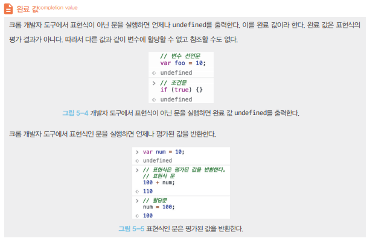

#### 5장. 표현식과 문

##### 5.1 값

> **값** 은 식(표현식)이 평가되어 생성된 결과를 말한다.
>
> **평가** 란 식을 해석해서 값을 생성하거나 참조하는 것을 의미한다.
>
> Ex) 10 + 20 은 평가되어 숫자 값 30을 생성한다.

모든 값은 데이터 타입을 가지며, 메모리에 2진수 비트의 나열로 저장되고, 메모리에 저장된 값은 데이터 타입에 따라 다르게 해석될 수 있다.

변수에 할당되는 것은 값으로 예제에서 변수 sum에 할당되는것은 10+20 이 아니라 10+20이 평가된 결과인 숫자 값 30이다.

Ex) var sum = 10 + 20;

 

##### 5.2 리터럴

> **리터럴** 은 사람이 이해할 수 있는 문자 또는 약속된 기호를 사용해 값을 생성하는 표기법
>
> 숫자리터럴, 문자리터럴 ...etc 

Ex ) 3 // 숫자 리터럴 3

3은 단순한 아라비아 숫자가 아닌 숫자 리터럴로, 사람이 이해할 수 있는 아라비아 숫자를 사용해 숫자 리터럴 3을 코드에 기술하면 자바스크립트 엔진은 이를 평가해 숫자 값 3을 생성

자바스크립트 엔진은 코드가 실행되는 시점인 `런타임` 에 리터럴을 평가해 값을 생성한다. 즉 리터럴은 값을 생성하기 위해 미리 약속한 표기법!

###### 자바스크립트 리터럴 종류


##### 5.3 표현식

> **표현식** 은 값으로 평가될 수 있는 문이다. 즉 표현식이 평가되면 새로운 값을 생성하거나 기존 값을 참조한다.

Ex) var score = 100;

위 예제의 100은 숫자 리터럴이고 자바스크립트 엔진에 의해 평가되어 값을 생성하므로 리터럴은 그자체로 표현식이다.

Ex) var score = 50 + 50;

위 예제는 숫자 리터럴과 연산자로 이루어 져있으며, 50+50은 평가되어 숫자 값 100을 생성하므로 표현식이다.

Ex) score // -> 100;

변수 식별자를 참조하면 변수 값으로 평가된다. 식별자 참조는 값을 생성하지는 않지만 값으로 평가되므로 표현식


=> 표현식은 리터럴, 식별자(변수,함수명) ,연산자 ,함수호출 등의 조합으로 이뤄 질수 있고 모두 값으로 평가된다. 따라서 **값으로 평가될 수 있는문은 표현식이다.**

```javascript
//리터럴 표현식
10
'Hello'

//식별자 표현식
sum
person.name
arr[1]

//연산자 표현식
10 + 10
sum = 10
sum !== 10

//함수, 메서드 호출 표현식
square()
person.getName()
```

=>표현식은 값으로 평가되고 표현식과 표현식이 평가된 값은 동등관계 동치이다. 따라서 표현식은 값처럼 사용할 수 있고, 이것은 문법적으로 값이 위치할 수 있는 자리에는 표현식도 위치할 수 있다는 것을 의미.

```javascript
var x = 1 + 2;

//식별자 표현식 x는 3으로 평가된다.
x + 3;
```

표현식은 다른 표현식의 일부가 되어 새로운 값으로 만들 수 있다.


##### 5.4 문

> `문`과 `표현식` 구분을 통해 해석할 때 자바스크립트 엔진의 입장에서 코드를 읽을 수 있고 실행 결과를 예측하는데 도움이되며, 이는 버그를 줄이고 코드의 품질을 높여줄 수 있다.

`문(statement)` 는 프로그램을 구성하는 기본 단위이자 최소 실행 단위이다. 문의 집합으로 이루어 진 것이 프로그램이고 문을 작성하고 순서에 맞게 나열하는 것이 프로그래밍이다.

`문` 은 여러 토큰으로 구성된다. `토큰` 이란 문법적인 의미를 가지며, 문법적으로 더 이상 나눌 수 없는 코드의 기본 요소

Ex). 키워드, 식별자, 여난자, 리터럴, 세미콜론이나 마침표 ( 문법적으로 더이상 쪼개기 불가능 )


`문`은 `명령문` 이라고도 부르고 컴퓨터에 내리는 명령이고 선언문, 할당문, 조건문, 반복문 등으로 구분할 수 있다.

```javascript
// 변수 선언문
var x;
// 할당문
x = 3
// 함수 선언문
function foo (){}
// 조건문
if( x > 1) { 
  console.log(x);
}
// 반복문
for(var i = 0; i < 2; i++){
  console.log(i);
}
```

 

##### 5.5 세미콜론과 세미콜론 자동 삽입기능

`세미콜론(;)` 은 문의 종료를 나타냄

자바스크립트 엔진은 세미콜론으로 문이 종료한 위치를 파악하고 순차저으로 하나씩 문을 실행.

if,for, 함수 등의 코드 블록 뒤에는 세미콜론을 붙이지 않음 (코드 블록은 언제나 문의 종료를 의미하는 자체 종결성을 갖기때문)

문의 끝에 붙이는 세미콜론은 옵션 (생략간능)

-> 자바스크립트 엔진이 소스코드를 해석할 떄 문의 끄이라고 예측되는 지점에 세미콜론을 자동으로 붙여주는 **세미콜론 자동 삽입 기능(ASI)** 이 암묵적으로 수행되기 때문에.

 BUT 세미콜론 자동 삽입 기능의 동작과 개발자의 예측이 일치하지 않는 경우가 발생할 수 있어 붙여주는게 바람직하다.

```javascript
function foo(){
  return
  {}
  //ASI의 동작결과 => return;{};
  //개발자의 예측   => return {};
}
consle.log(foo()); // undefined

var bar = function(){}
(function(){})();
//ASI의 동작 결과 => var bar = function(){}(function(){})();
//개발자의 예측 => var bar = function(){};(function(){})();
//TypeError: (intermediate value)(...) is not a function
```


##### 5.6 표현식인 문과 표현식이 아닌 문

> 표현식은 문의 일부일 수도 있고 그 자체로 문이 될 수도 있다.

```javascript
// 변수 선언문은 값으로 평가될 수 없으므로 표현식이 아니다.
var x;
// 1, 2, 1+2, x=1+2는 모두 표현식이다.
// x=1+2는 표현식이면서 완전한 문이기도 하다.
x = 1 + 2;
```


문에는 표현식인 문과 표현식이 아닌 문이 있다. 표현식인 문은 값으로 평가될 수 있는 문이며, 표현식이 아닌 문은 값으로 평가될 수 없는 문을 말한다.

변수 선언문은 값으로 평가될 수 없으니 표현식이 아닌 문이다. 하지만 할당문은 값으로 평가될 수 있어 표현식인 문이다.

**표현식인 문과 표현식이 아닌 문을 구별하는 가장 간단하고 명료한 방법은 변수에 할당해 보는 것**

표현식인 문은 값으로 평가되므로 변수에 할당할 수 있다. 하지만 표현식이 아닌 문은 값으로 평가할 수 없으므로 변수에 할당하면 에러 발생

```javascript
// 변수 선언문은 표현식이 아닌 문이다.
var x; // 값으로 평가 불가
// 할당문은 그 자체가 표현식이지만 완전한 문이기도 하다. 즉 , 할당문은 표현식인 문이다.
x = 100;
```


```javascript
// 표현식이 아닌 문은 값처럼 사용 불가능
var foo = var x; //SyntaxError: Unexpected token var

// 표현식인 문은 값처럼 사용할 수 있다
var foo = x = 100 
console.log(foo) // 100
```


완료값

