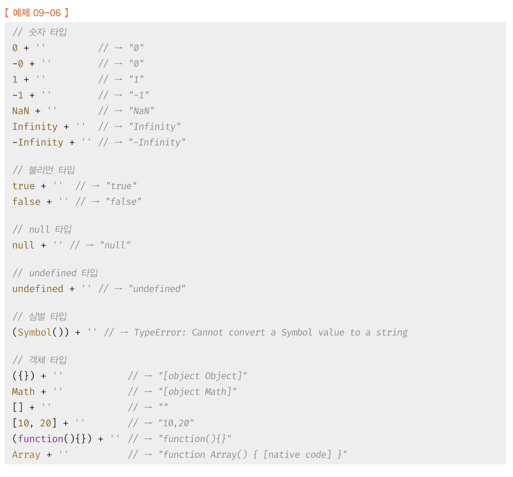
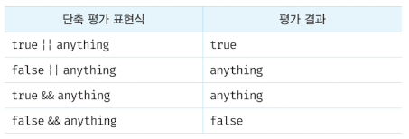

#### 9장 타입 변환과 단축 평가


##### 9.1 타입 변환이란? 

> 자바스크립트의 모든 값은 타입이 있고, 값의 타입은 개발자의 의도에 따라 다른 타입으로 변환가능

* 개발자가 의도적으로 타입 변환 => `명시적 타입 변환` or `타입 캐스팅`

```javascript
var x = 10;

// 명시적 타입변환 (숫자 -> 문자)
var str = x.toString();
console.log(typeof str, str) // string 10

// x 변수의 값이 변경된것 X
console.log(typeof x,x); // number 10
```


* 개발자의 의도와는 상관없이 표현식을 평가하는 도중에 자바스크립트 엔진에 의해 암묵적으로 타입 자동 변환 

=> `암묵적 타입 변환` or `타입 강제 변환`

```javascript
var x = 10;

// 암묵적 타입 변환 (문자열 연결 연산자는 숫자 타입 x의 값을 바탕으로 새로운 문자열 생성)
var str = x + '';
console.log(typeof str, str) // string 10

// x 변수의 값이 변경된 것 X
console.log(typeof x, x) // number 10
```

*팁!*  console.log(변수 , 변수)  => 값을 한칸 띄우고 찍어줌 !

> 위의 예제에서 자바스크립트 엔진은 표현식 x + ' '을 평가하기 위해서 x 변수의 숫자 값을 바탕으로 새로운 문자열 값 '10'을 생성하고 이것으로 표현식 '10' + ' '를 평가
>
> 변경된 값을 기존 변수에 재할당 하여 변경하는 것이 아닌, 엔진에서 에러 없이 평가하기 위해서 피연산자의 값을 암묵적 타입 변환을 해서 새로운 타이의 값을 만들어 단 한번 사용 하고 버림 
>
> **명시적 타입변환은 코드에 들어나지만, 암묵적 타입 변환은 엔진에 의해 자동 변환 되기 때문에  타입 변환을 이해하고, 예측 가능하여야 한다.**


* 타입 변환은 기존 원시 값을 직접 변경하는 것이 아님. 
* 원시 값은 `변경 불가능한 값(immutable value)`이라서 변경이 불가능 ! 
* 타입 변환은 기존 원시 값을 사용해 다른 타입의 새로운 원시 값을 생성 !


##### 9.2 암묵적 타입 변환

> 자바스크립트 엔진은 표현식을 평가할 때 개발자의 의도와는 상관없이 코드의 문맥을 고려해 암묵적으로 데이터 타입을 강제 변환 하기도 한다.

```javascript
// 피연산자가 모두 문자열 타입이어야 하는 문맥
'10' + 2 // '102'

// 피연산자가 모두 숫자 타입이어야 하는 문맥 ( - * /)
5 * '10' // 50

// 피연산자 또는 표현식이 불리언 타입이어야 하는 문맥 (자주 사용!)
!0 // true
if(1){}
```

=> 암묵적 타입 변환이 발생하면 문자열 , 숫자, 불리언과 같은 원시 타입 중 하나로 타입을 자동 변환 


###### 9.2.1 문자열 타입으로 변환

> 식을 평가할때 피연산자 중 한개 이상이 문자열일때 + 는 산술연산자가 아닌 문자열 연결 연산자로 동작
>
> 문자열 연결 연산자는 문자열 값을 만드는 역할로 피연산자는 모두 문자열 타입이여야 한다.
>
> 자바스크립트 엔진은 이러한 연결 연산자 평가를 위해서 피연산자 중  문자열 타입이 아닌 피연산자를 문자열 타입으로 암묵적 변환 실행
>
> *!* 연산자 표현식의 피연산자 만이 암묵적 타입 변환 대상 x
>
> => 자바스크립트 엔진은 표현식을 평가할 때 코드 문맥에 부합하도록 암묵적 타입 변환 실행

Ex) Es6 x템플릿 리터럴 표현식 삽입

```javascript
`1 + 1 = ${1 + 1}` // "1 + 1 = 2"
```


* 자바스크립트엔진이 문자열 타입 아닌 값을 문자열 타입으로 암묵적 타입 변환을 수행할 때의 동작




###### 9.2.2 숫자 타입으로 변환

> 산술 연산자의 역할은 숫자 값을 생성하는 것이기 때문에 모든 피연산자는 코드 문맥상 모두 숫자 타입
>
> 자바스크립트 엔진은 산술 연산자 표현식을 평가하기 위해 산술 연산자의 피연산자 중에 숫자 타입이 아닌 피연산자는 암묵적으로 타입 변환을 실행.
>
> 피연산자중 강제 타입 변환 수행이 안될경우 NaN 결과 리턴

```javascript
1 - '1'				//0
1 * '10'			//10
1 / 'one'			//NaN
```


> 비교 연산자의 역할은 불리언 값을 만드는것
>
> 비교 연산자는 피연산자의 크기를 비교하므로 모든 피연산자는 숫자 타입이여야 하기 때문에 자바스크립트 엔진은 암묵적 타입 변환 실행

* 숫자 타입이 아닌 값을 숫자 타입으로 암묵적 타입 변환을 수행할 때 

```javascript
// 문자열 타입
+ ''			//0
+'0'			//0
+'1'			//1
+'string'	//NaN

// 불리언 타입
+true			// 1
+false		// 0

// null 타입
+null			//0

// undefined 타입
+undefined	// NaN

// 심볼 타입
+Symbol()		// TypeError : Cannot convert a Symbol value to a number

// 객체 타입
+{}					//NaN
+[]					//0
+[10,20]		//NaN
+(function(){})	// NaN
```


###### 9.2.3 불리언 타입으로 변환

> if 문이나 for문과 같은 제어문 또는 삼항 조건 연산자의 조건식은 불리언값, 논리적 참/거짓으로 표현되어야 해서, 조건식의 평가 결과를 불리언 타입으로 암묵적 타입 변환 수행 필요

```javascript
if('') console.log('1');
if(true) console.log('2');
if(0) console.log('3');
if('str') console.log('4');
if(null) console.log('5');

// 2 4
```

* 자바스크립트 엔진은 불리언 타입이 아닌 값을 Truthy(참으로 평가되는 값) 또는 Falsy (거짓으로 평가되는 값)으로 구분


Falsy한 값

1. false
2. undefined
3. null
4. 0 , -0
5. NaN
6. ''(빈 문자열)

```javascript
if(!false && !undefined && !null && !0 && !NaN && !''){
	console.log('work well!')
}
```

> Falsy 값 외의 모든 값들은 모두 true 로 평가되는 Truthy값


##### 9.3 명시적 타입 변환

> 개발자의 의도에 따라 명시적으로 타입 변경 방법
>
> 1. 표준 빌트인 생성자 함수(`String`, `Number`, `Boolean`)를 new 연산자 없이 호출하는 방법
> 2. 빌트인 메서드를 사용하는 방법
> 3. 암묵적 타입변환 이용


*표준 빌트인 생성자 함수와 빌트인 메서드*

* 표준 빌트인 생성자 함수와 표준 빌트인 메서드는 자바스크립트에서 기본적으로 제공 하는 함수
* 표준 빌트인 생성자 함수는 객체 생성을 위한 함수이며 new 연산자와 함께 호출
* 표준 빌트인 메서드는 자바스크립트에서 기본 제공하는 빌트인 객체의 메서드


###### 9.3.1 문자열 타입으로 변환

>1. String 생성자 함수를 new 연산자 없이 호출
>2. Object.prototype.toString 메서드를 사용하는 방법
>3. 문자열 연결 연산자를 이용하는 방법

```javascript
// 1번
// 숫자 => 문자
String(1)			//"1"
String(NaN)		//"NaN"
String(Infinity)//"Infinity"
// 불린 => 문자
String(true)	//"true"
String(false)	//"false"

// 2번방법
// 숫자 => 문자
(1).toString();					//"1"
(NaN).toString();				//"NaN"
(Infinity).toString();	//"Infinity"
// 불린 => 문자
(true).toString()				// "true"
(false).toString()			//	"false"

// 3번 방법
// 숫자 => 문자
1 + '';					//"1"
NaN + '';				//"NaN"
Infinity + '';	//"Infinity"
// 불린 => 문자
true + '';			//"true"
false + '';			//"false"
```


###### 9.3.2 숫자 타입으로 변환

> 1. Number 생성자 함수를 new 연산자 없이 호출
> 2. parseInt, parseFloat 함수 사용하는 방법 (문자열만 -> 숫자로)
> 3.  +단항 산술 연산자 이용
> 4.  *산술 연산자 이용

```javascript
// 1번은 문자열과 동일

// 2번 함수 이용
parseInt('0')				// 0
parseInt('-1')			// -1
parseFloat('10.43')	// 10.43

// 3번 + 단항 산술 연산자
// 문자 => 숫자
+'0'					// 0
+'-1'					// -1
+'10.53'			// 10.53
// 불린 => 숫자
+true;				// 1
+false;				// 0

// 4번 * 산술 연산자 사용
// 문자 => 숫자
'0' * 1;			// 0
'-1' * 1;			// -1
'10.53' * 1;	// 10.53
// 불린 => 술자
true * 1			// 1
false * 1 		// 0
```


###### 9.3.3 불리언 타입으로 변환

> 1. Boolean 생성자 함수를 new연산자 없이 호출
> 2. ! 부정 논리 연산자를 두 번 사용하는 방법

=> **truly or falsy 한 값만 판단하면 결과 예측 가능**


#### 9.4 단축평가

##### 9.4.1 논리 연산자를 사용한 단축 평가

> `논리합(||)` 또는 `논리곱(&&)` 연산자 표현식의 평가 결과는 불리언 값이 아닐 수도 있다 !
>
> `논리합(||)` 또는 `논리곱(&&)` 연산자 표현식은 언제나 2개의 피연산자 중 어느 한쪽으로 평가됨

Ex ) `'Cat' && 'Dog'		// Dog`

* 논리곱 연산자는 두 개의 피연산자가 모두 true로 평가 될때 true를 반환
* 논리곱 연산자는 좌항에서 우항으로 평가가 진행됨

=> 첫번째 피연산자 'Cat' 은 `Truthy` 값이므로 true로 평가됨. 하지만 이 시점까지는 위 표현식을 평가할 수 없다

=> 두번째 피연산자까지 평가해보아야 표현식 평가할 수 있음.

=> 이 평가식은 두번째 피연산자가 표현식의 평가를 결정한다. 이때 논리곱 연산자는 **논리 연산의 결과를 결정하는 두 번째 피연산자 문자열 'Dog'를 그대로 반환*


Ex)`'Cat' || 'Dog' 		// Cat`

* 논리합도 논리곱과 동일하게 동작
* 논리합 연산자는 하나의 평가만  true이면 true를 반환

=> 첫번쨰 피연산자 'Cat' 가 `Truthy`한 값이므로 두번째 피연산자 까지 평가하지 않아도 true 

=> 따라서 논리 연산의 결과를 경정한 첫 번째 피연산자를 반환


***논리 연산의 결과를 경정하는 피연산자를 타입 변환하지 않고 그대로 반환하는 것을 `단축평가`라고 하며 표현식을 평가하는 도중에 평가 결과가 확정된 경우 나머지 평가 과정을 생략***




**사용법**

* 논리곱(&&) => true일떄 조건실행을 축약표현
* 논리합(||)  => false일때 조건 실행을 축약표현
* 삼항 조건 연산자로 if else 대체 가능

```javascript
// 1. 논리곱 활용
var done = true;
var message = '';

if(done) message = '완료';
// 단축 표현
// done이 true라면 message에 '완료'라는 값 할당
message = done && '완료';
console.log(message)	// 완료

// 2. 논리합 활용
var done = false;
var message = '';

if(done) message = '미완료';
//단축 표현
// done이 false라면 message에 '미완료'라는 값 할당
message = done || '미완료';
console.log(message);

// 3. 삼항 연산자 사용
var done = true;
var message = '';

if(done) message='완료';
else message='미완료';
console.log(message)	//완료

// 삼항연산자 활용식
message = done ? '완료' : '미완료';
console.log(message); //완료
```


**유용한 활용**

1. 객체를 가리키기를 기대하는 변수가 null 또는 undefined가 아닌지 확인하고 프로퍼티를 참조할 때

   > Null 혹은 undefined 인 경우 객체 프로퍼티 참조시 타입 에러가 발생되며 프로그램이 종료된다.
   >
   > ```javascript
   > var elem = null;
   > var value = elem.value 		// TypeError: Cannot read proprty 'value' of null
   > 
   > // 단축 평가 활용
   > var elem = null;
   > // elem이 null 이나 undefined와 같은 falsy 값이면 elem으로 평가되고 elem이 truthy 값이면 elem.value 로 평가
   > var value = elem && elem.value; // null;
   > ```

2. 함수 매개변수에 기본값을 설정할때

3. > 함수를 호출할 때 인수를 전달하지 않으면 매개변수에 undefined가 할당되고, 그값을 활용할때 오류가 발생
   >
   > ```javascript
   > // 단축 평가를 사용한 매개변수의 기본값 설정
   > function getStringLength(str){
   >   str = str || '';
   >   return str.length;
   > }
   > 
   > getStringLength();		// 0
   > getStringLength('hi')	// 2
   > 
   > // ES6의 매개변수의 기본값 설정
   > function getStringLength(str = ''){
   >   return str.length;
   > }
   > getStringLength();		// 0
   > getStringLength('hi')	// 2
   > ```


###### 9.4.2 옵셔널 체이닝 연산자

> ES11 에서 도입된 옵셔널 체이닝 연산자 `?.`는 좌항의 피연산자가 null 또는  undefined인 경우 undefined를 반환하고, 그렇지 않으면 우항의 프로퍼티 참조를 이어간다.

```javascript
var elem = null;

//elem 이 null 또는 undefined이면 undefined를 반환하고, 그렇지 않으면 우항 참조
var value = elem?.value;
console.log(value); 		//undefined
```

=> && 연산자 활용이랑 동일한 결과 

차이점

> 논리 연산자 &&는 좌항 피연산자가 false로 평가되는 falsy 값이면 좌항 피연산자를 그대로 반환
>
> 옵셔널 체이닝 연산자 ?. 는 좌항 피연산자가 false로 평가되는 값이라도 null , undefined 가 아니면 우항 프로퍼티를 참조
>
> => 옵셔널 체이닝 연산자는 null, undefined 체크에 최적화

```javascript
var str = '';
// 문자열 길이(length)를 참조
var length = str && str.length;
// 문자열 길이를 참조하지 못함.	//falsy한 값이라 좌항을 바로 반환하기 때문에 !!
console.log(length); 


var str = '';
// 문자열 길이 참조
// null ,undefined 가 아니면 우항의 프로퍼티 참조를 계속 진행
var length = str?.length;
console.log(length); 	// 0
```


###### 9.4.3 null 병합 연산자

> ES11 에서 도입된 null 병합 연산자 ??는 좌항의 피연산자가 null 또는 undefined인 경우 우항의 피연산자를 반환하고, 그렇지 않으면 좌항의 피연산자를 반환한다. null 병합 연산자 ?? 는 변수에 기본값을 설정할 때 유용하다.

```javascript
// 좌항 피연산자가 null, undefined 이면 우항 피연산자를 반환하고, 아니면 좌항 반환
// 디폴트값 설정에 편리
var foo = null ?? 'default string'
console.log(foo);		//'default string'
```

=> || 연산자 활용이랑 동일한 결과

차이점

> 논리 연산자 || 는 좌항 피연산자가 false로 평가되는 falsy 값이면 우항의 피연산자 반환 만약 0, ' '도 기본값으로 유효하면 문제 발생
>
> null 병합 연산자는 ??는 좌항의 피연산자가 false로 평가되는 falsy 값이라도 null 또는 undefined가 아니면 좌항 피연산자를 그대로 반환

```javascript
// foo 기본값이 '', 0의 falsy한 값이면 문제 !
var foo = '' || 'default string';
console.log(foo)	// 'default string'

// null , undefined 만 아니면 좌항 리턴
var foo = '' ?? 'default String';
console.log(foo);			// ''
```

